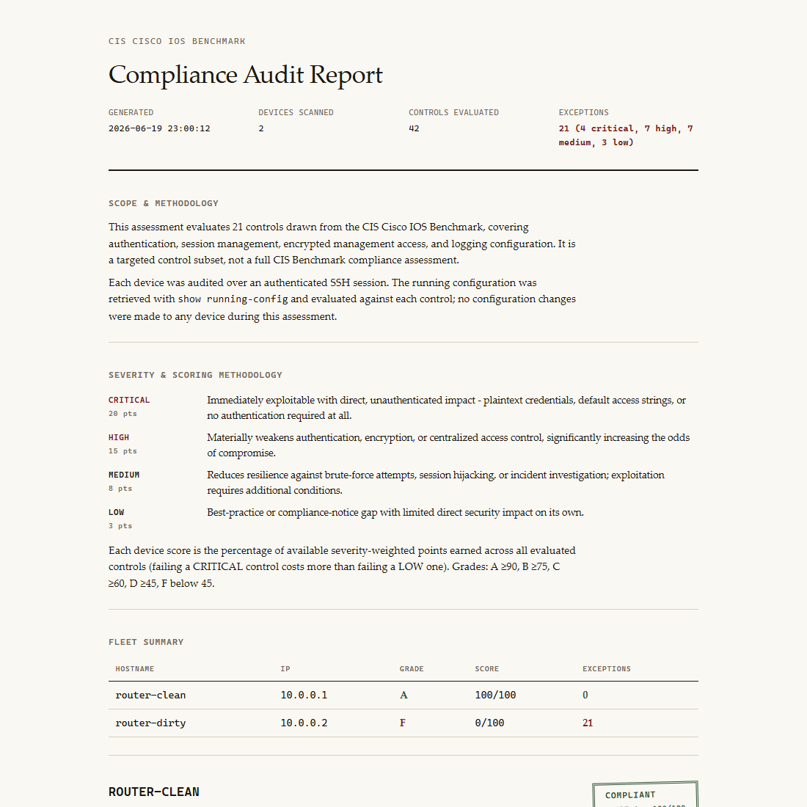
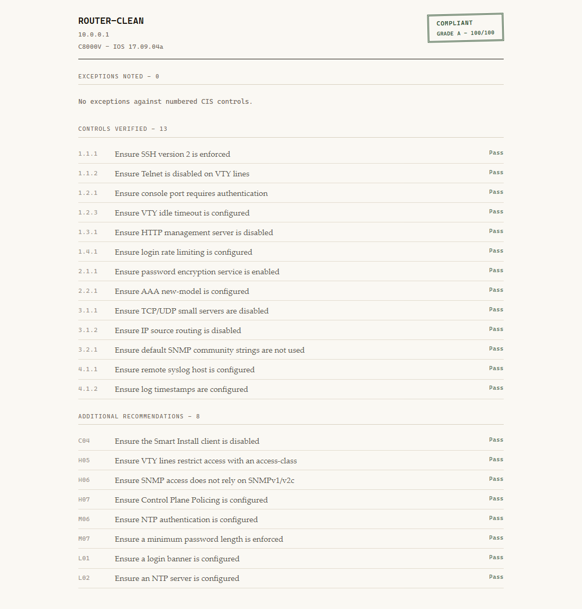
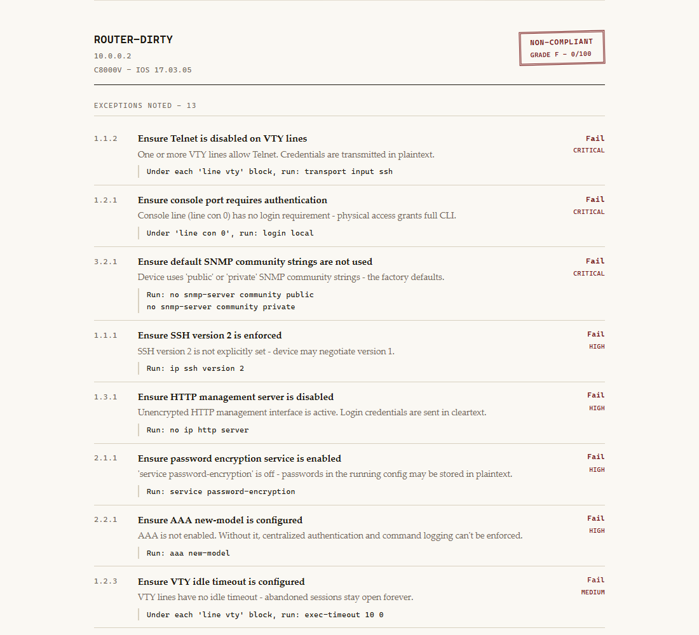
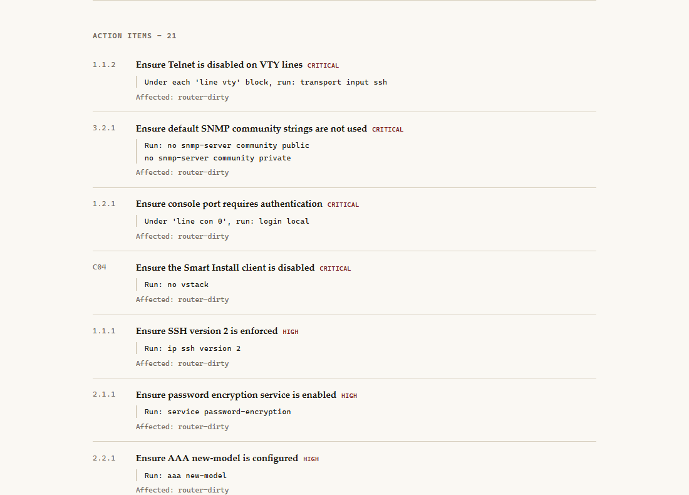

# Cisco Network Security Auditor

[](LICENSE)

A multithreaded Python CLI that connects to Cisco IOS devices over SSH and audits the running configuration against CIS Benchmark hardening controls. It produces a compliance-style HTML report with a weighted risk score and letter grade for each device.

## Sample report

**Cover, scope and methodology, severity key, and fleet summary:**



**A compliant device, every control passing:**



**A non-compliant device, exceptions listed worst severity first:**



**The fleet-wide action items appendix, deduplicated and prioritized:**



The full report is in [`sample_report.html`](sample_report.html), generated from synthetic clean/dirty device fixtures by `smoke_test.py`.

## How it works

Here's the path a single audit run takes:

```
main.py -> auditor.scanner.run_audit()
      Nornir + Netmiko, threaded SSH across the fleet (inventory/hosts.yaml)
      show running-config -> auditor.checks.run_all_checks() -> Finding list
      show version -> device OS/model
  -> auditor.report.generate_report() -> Jinja2 -> audit_report.html
```

Each device gets a severity-weighted score (CRITICAL=20, HIGH=15, MEDIUM=8, LOW=3) and a letter grade, so one CRITICAL failure hurts the score far more than one LOW failure.

## Checks (21 controls)

The checks span management plane, control plane, and CVE-driven exploit hardening (Telnet, SSH, AAA, SNMPv3, Control Plane Policing, Smart Install). 15 of the 21 carry a real CIS Cisco IOS Benchmark control number; the rest are real-world hardening practice that isn't tied to a specific control.

<details>
<summary>Full list of 21 checks</summary>

| ID | Check | Severity |
|---|---|---|
| C01 | Telnet permitted on VTY lines | CRITICAL |
| C02 | Default SNMP community strings | CRITICAL |
| C03 | Console port requires no authentication | CRITICAL |
| C04 | Smart Install client not disabled | CRITICAL |
| H01 | SSH version 2 not enforced | HIGH |
| H02 | Password encryption service disabled | HIGH |
| H03 | AAA new-model not configured | HIGH |
| H04 | HTTP management server enabled | HIGH |
| H05 | VTY lines lack an access-class restriction | HIGH |
| H06 | SNMP access relies on SNMPv1/v2c | HIGH |
| H07 | Control Plane Policing not configured | HIGH |
| M01 | Login rate limiting not configured | MEDIUM |
| M02 | VTY idle timeout not configured | MEDIUM |
| M03 | IP source routing enabled | MEDIUM |
| M04 | Remote syslog host not configured | MEDIUM |
| M05 | Log timestamps not configured | MEDIUM |
| M06 | NTP authentication not configured | MEDIUM |
| M07 | Minimum password length not enforced | MEDIUM |
| L01 | No login banner configured | LOW |
| L02 | NTP server not configured | LOW |
| L03 | TCP/UDP small servers enabled | LOW |

Each check is a pure function operating on raw config text, registered in `ALL_CHECKS` (`auditor/checks.py`).

</details>

## Scope and methodology

This is a targeted subset of the CIS Cisco IOS Benchmark, not a full compliance assessment, and the generated report says so directly instead of implying full coverage. The audit connects over an authenticated SSH session, reads `show running-config` and `show version`, and makes no configuration changes to the device.

## Limitations

- **Regex-based checks, not a structured config parser.** Checks match patterns directly against the raw `show running-config` text instead of parsing it into a config tree (e.g. via `ciscoconfparse`). This trades some robustness against unusual formatting for a dependency-free tool where it's easy to see exactly which line in the config triggered a finding.
- **One platform, one benchmark.** Targets Cisco IOS only, against a 21-control subset of the published CIS Cisco IOS Benchmark. No IOS-XR, NX-OS, or other vendor support.
- **Read-only by design.** The audit never writes to a device's config. Findings come with remediation commands, but applying them is a manual step the user takes, not something this tool does on its own.

## Getting started

Requires Python 3.12+.

```bash
pip install -r requirements.txt
cp inventory/hosts.yaml.example inventory/hosts.yaml   # fill in real device credentials, this file is gitignored
python main.py
```

Useful flags:

```bash
python main.py --config nornir.yaml --output my_report.html
python main.py --no-report   # terminal output only, skip the HTML report
```

`main.py` exits non-zero if any device has a failing CRITICAL or HIGH severity control, so it can be wired into a CI/CD pipeline as a hard gate rather than just producing a report nobody reads.

### Example output

Terminal summary for a single device (synthetic dirty fixture, see `smoke_test.py`), truncated for brevity:

```
cisco-auditor - connecting to devices...

  [router-dirty]  10.0.0.2
  Score: 0/100  Grade: F

    [FAIL] [C01] CRITICAL  Ensure Telnet is disabled on VTY lines
    [FAIL] [C02] CRITICAL  Ensure default SNMP community strings are not used
    [FAIL] [C03] CRITICAL  Ensure console port requires authentication
    [FAIL] [C04] CRITICAL  Ensure the Smart Install client is disabled
    [FAIL] [H01] HIGH      Ensure SSH version 2 is enforced
    ...

  0 passed, 21 failed

  Report saved to: audit_report.html
```

## Testing

```bash
python -m pytest tests/ -v
python smoke_test.py   # generates sample_report.html from synthetic clean/dirty fixtures
```

`tests/test_checks.py` covers all 21 checks individually, with minimal config snippets for both the passing and failing case. That way, a check that happens to pass in a large fixture for the wrong reason still gets caught. CI runs the full suite plus the smoke test on every push and pull request against `main`.

## License

MIT, see [LICENSE](LICENSE).
